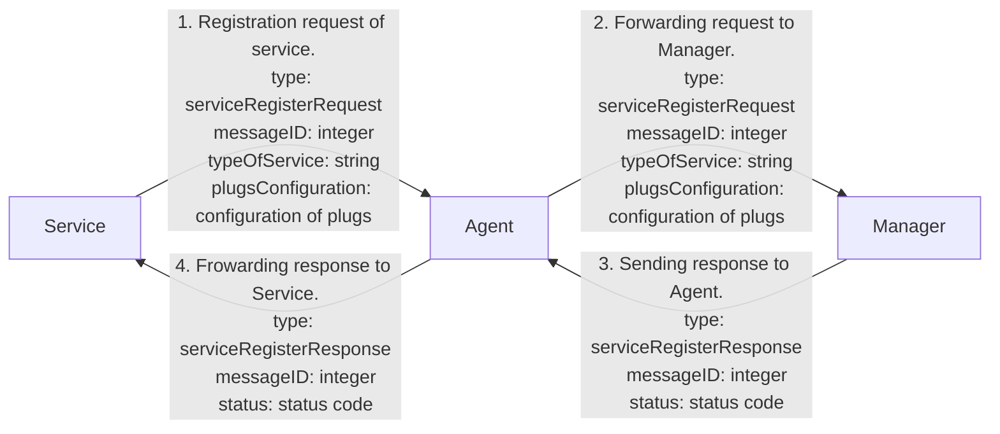
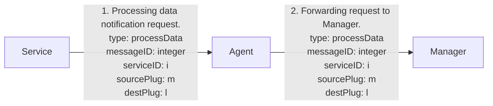
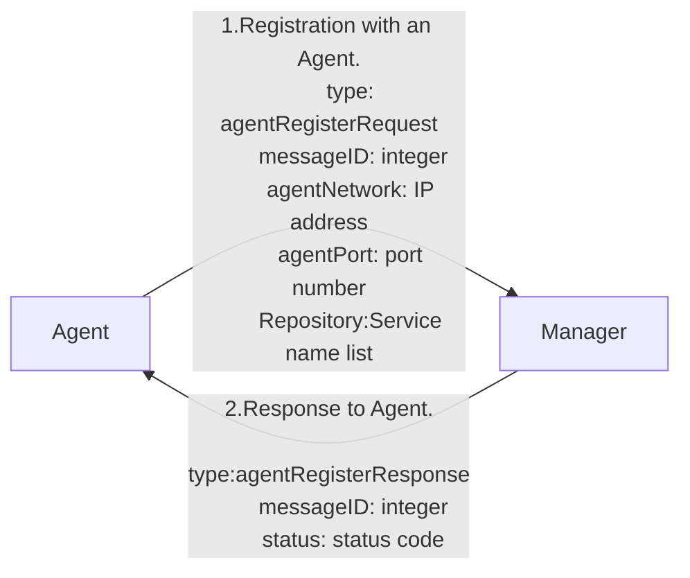
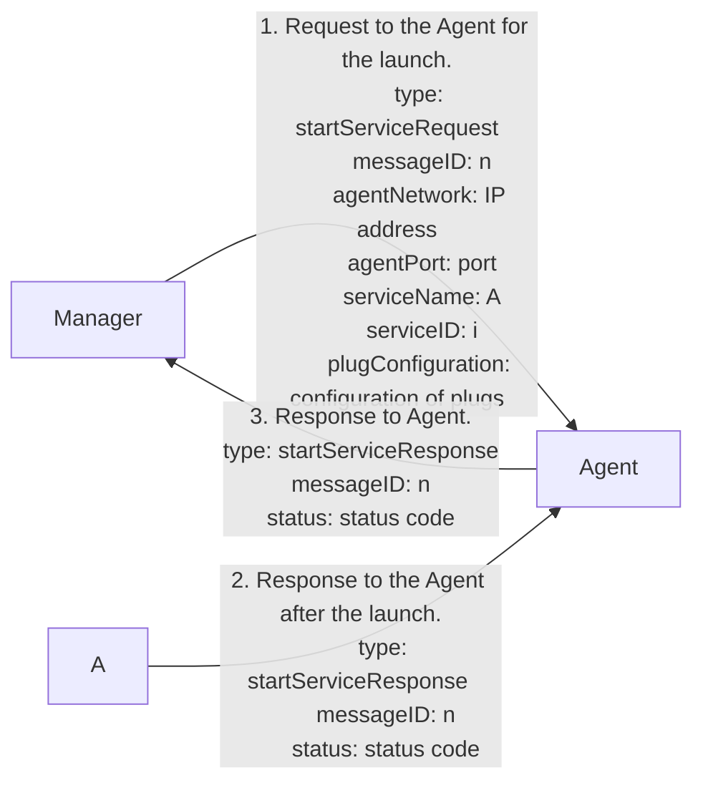
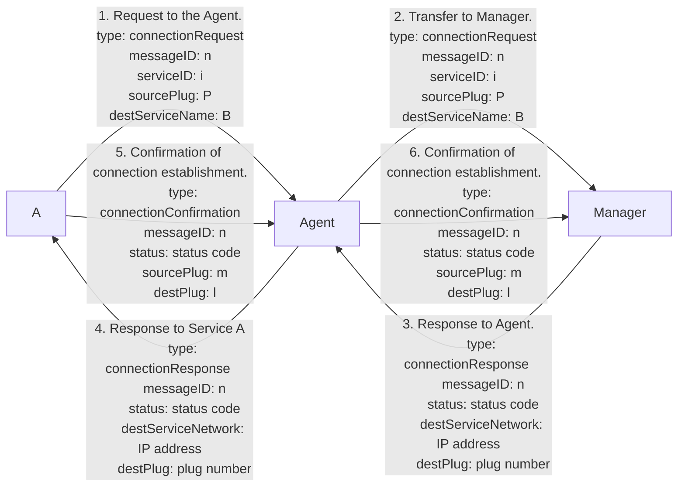
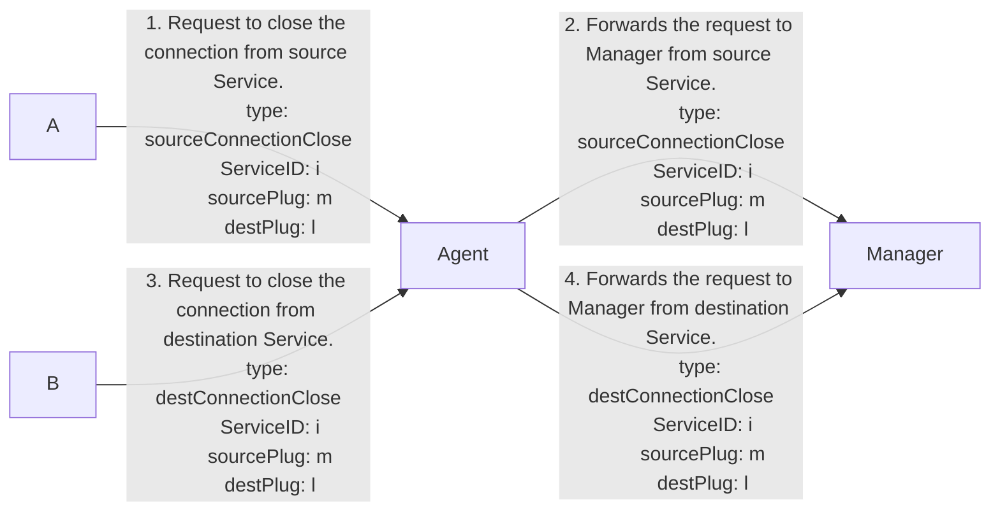
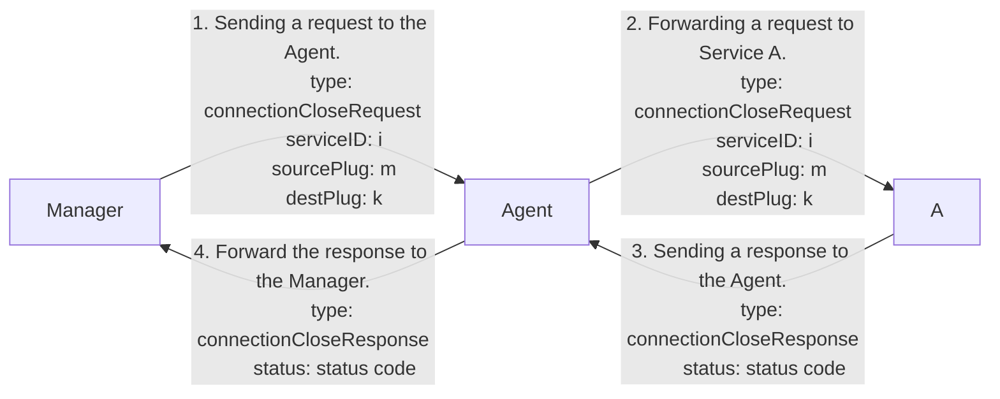
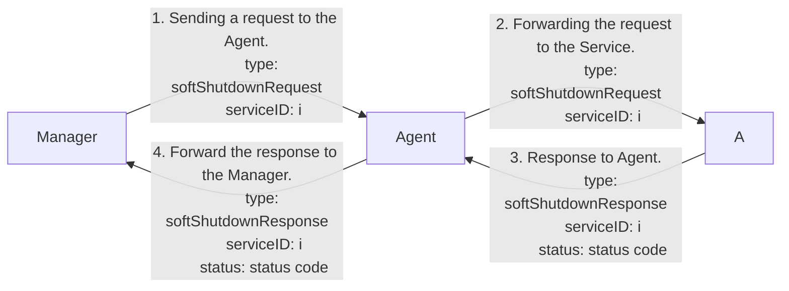
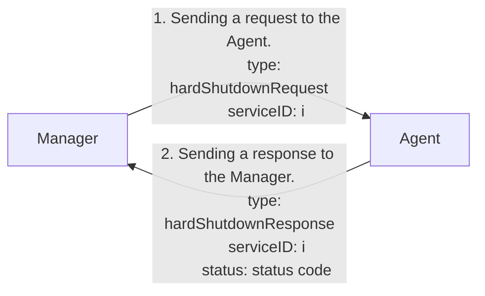

# SMMP
Implementation of protocol for managing a service mesh.

## Individual services

[Manager description](/Manager/README.md "Manager")
[Agent description](/Agent/README.md "Agent")
[Api Gateway description](/ApiGateway/README.md "Api Gateway")
[Description of services that are using protocole](/Service/README.md "Services")

## Short summary

- Manager:
  - Brain of application
  - Knows everything about Services:
    - Number of each Services
    - Connections between Services
    - Their history 
  - Is searching for innactive connections or Services
  - Dynamically assigns ports for new instances of Services

- Agent:
  - Right hand of Manager
  - Is permanently connected to Services
  - Is launching service by creating new process
  - Can close Services by closing process *not tested*
  - Is the bridge that connects Services and Manager

- Api Gateway:
  - Is connected to Agent
  - Is receiving requests from user
  - Is dynamically connecting to Services based on request from user

- Services used in implementation:

## Long summary

### Manager

- Is running on startup 
- Has a permanent connection to the Agent
- Receives data from the Agent
- Sends data back to the Agent
- Stores information about Service
- Through the Agent, starts the Service that is requested
- Stores data about the Services that are running:
  - When they were last used
  - History logs
  - Their plugs:
    - Is plug in or out
    - Is plug connected
    - When plug was last used 
- In this implementation stores data about:
- Closes Services when not in use
- Closes connections between Services when not in use

### Agent

- Is running on startup
- Has a permanent connection to the Manager
- Passes messages to the Manager
- Receives messages from the Manager
- Starts the Service
- Has a permanent connection to Services
- When Service connecting, starts a thread that maintains the connection to the Service

### Api Gateway

- Is running on startup
- Is permanently connected to the Agent
- Sends data to the Agent
- Receives data from the Agent
- Sends requests to the Manager via Agent for ports of other Services
- Sends a message to connect to another Service 
- Receives data from customers 
- Sends notification of disconnection from Service
- Close the connection after getting a command from the Manager
- Maintains connections with other Services

### Services

- Are permanently connected to the Agent
- Receive data from the Agent
- They send data to the Agent
- At startup, they send confirmation of startup 
- At the start of the Service, they start a thread to connect to the Agent
- They communicate with the Agent to receive the port of other Services
- They wait for requests from other Services
- They send a request to connect to another Service 
- Send a notification about disconnect from another Service
- Close after getting a command from the manager 
- Close the connection after getting a command from the manager
- Maintain connection with other Services

## Graphs of action

Graphs was made via: **[Mermaid](https://mermaid.js.org/)**

### Graph of registration services that work from the beginning and aren't launched via Agent

### Graph of service notification that it has processed data

### Graph of Agent Registration to Manager  

### Graph of instantiation startup A

### Graph of establishing a connection between Service A and Service B

### Graph of the closing connection between Service A and Service B

### Graph of the closure of the connection of Service A with Service B at the command of the Manager

### Graph of the closure of Service A at the request of the Manager soft version

### Graph of closure Service A at the request of the Manager hard version

